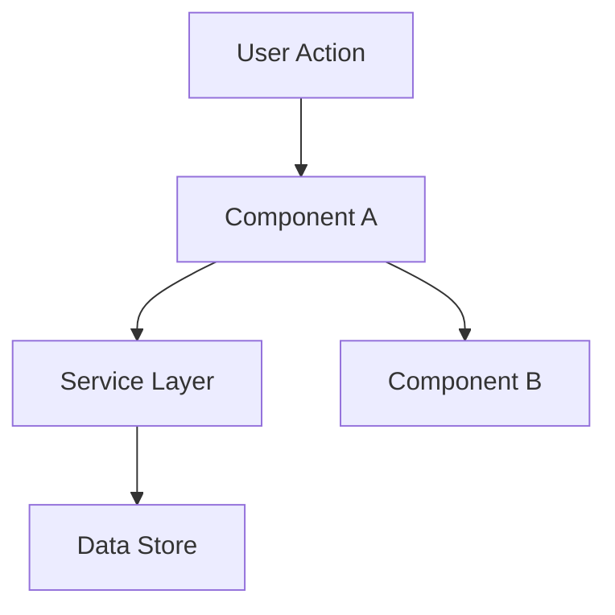

# lspec-auto

Executa ciclo completo de desenvolvimento de features: Discovery → Discuss* → Specify → Clarify* → Design* → Tasks → Execute.

## AUTO-DETECÇÃO (rode primeiro)

Analise a mensagem do usuário para detectar o tipo de tarefa:

```bash
MSG="$1"
if echo "$MSG" | grep -iE "bug|erro|falha|problema|não funciona|quebrou|falhar|fixar|corrigir" > /dev/null; then
  echo "BUG"
elif echo "$MSG" | grep -iE "feature|melhoria|adicionar|novo|criar|implementar" > /dev/null; then
  echo "FEATURE"
elif echo "$MSG" | grep -iE "map|analyze|existing|codebase" > /dev/null; then
  echo "MAP"
else
  echo "GENERAL"
fi
```

**Ações por tipo:**

|| Tipo | Fluxo |
||------|-------|
|| BUG | Discovery curto (3 perguntas) → Specify → Tasks → Execute |
|| FEATURE | Discovery focado → Specify → Clarify? → Tasks → Execute |
|| MAP | Use `lspec-map` diretamente |
|| GENERAL | Discovery completo → Todas as fases |

## Regras de Uso

- **NUNCA** utilizar quick mode
- **NUNCA** utilizar auto-sizing
- **Estrutura**: apenas `features/`, **nunca** `fixes/`
- **Autosave**: estado salvo em cada fase

## Fluxo de Execução

**APÓS CADA FASE, SEMPRE PERGUNTE:**

```
✅ [Fase atual] completa
→ Deseja avançar para [próxima fase]? (Opcional/Obrigatório)
```

**Regras de confirmação:**
- **OBRIGATÓRIO**: "Avançar para [próxima]?" → usuário responde sim/não
- **OPCIONAL**: "Há áreas cinzentas a discutir?" → usuário decide se pula
- Se OPCIONAL e usuário diz "não precisa" → salve estado e pule
- Se OBRIGATÓRIO → usuário deve confirmar, senão continua refinement

---

## FASE 1: DISCOVERY

**OBRIGATÓRIO** — Sempre inicia aqui

Collect: objetivo, problema, usuário-alvo, MVP, stack, referências, riscos, marcos

### Adaptar por Tipo:

**Se BUG detectado:**
1. O que não está funcionando?
2. Qual o comportamento esperado vs atual?
3. Como reproduzir o bug?

**Se FEATURE detectada:**
1. O que a feature deve fazer?
2. Quem vai usar?
3. Como sabe que está pronto?

**Se GENERAL/NOVO:**
6 fases completas (ver lspec-discovery)

**Ao finalizar:** "Discovery completo. Deseja avançar para Discuss (opcional — áreas cinzentas)?"

---

## FASE 2: DISCUSS

**OPCIONAL** — Só se há ambiguidade

Capturar contexto em áreas cinzentas (layout, interações, edge cases)

**Ao finalizar:** "Discuss completo. Avançar para Specify (obrigatório)?"

---

## FASE 3: SPECIFY

**Goal**: Capture WHAT to build with testable, traceable requirements.

If the feature has ambiguous gray areas (multiple valid approaches for user-facing behavior), the agent will automatically trigger the discuss gray areas process within this phase. For clear, well-defined features, it goes straight to the next phase.

### Process

#### 1. Clarify Requirements

You are a thinking partner, not an interviewer. Start open — let the user dump their mental model. Follow the energy: whatever they emphasize, dig into that.

Ask conversationally (not as a checklist):

- "What problem are you solving?"
- "Who is the user and what's their pain?"
- "What does success look like?"

If needed:

- "What are the constraints (time, tech, resources)?"
- "What is explicitly out of scope?"

**Challenge vagueness.** Never accept fuzzy answers. "Good" means what? "Users" means who? "Simple" means how? Make the abstract concrete: "Walk me through using this." "What does that actually look like?"

**Know when to stop.** When you understand what they're building, why, who it's for, and what done looks like — offer to proceed.

#### 2. Capture User Stories with Priorities

**P1 = MVP** (must ship), **P2** (should have), **P3** (nice to have)

Each story MUST be **independently testable** - you can implement and demo just that story.

#### 3. Write Acceptance Criteria

Use **WHEN/THEN/SHALL** format - it's precise and testable:

- WHEN [event/action] THEN [system] SHALL [response/behavior]

### Template: `.specs/[feature]/spec.md`

```markdown
# [Feature Name] Specification

## Problem Statement

[Describe the problem in 2-3 sentences. What pain point are we solving? Why now?]

## Goals

- [ ] [Primary goal with measurable outcome]
- [ ] [Secondary goal with measurable outcome]

## Out of Scope

Explicitly excluded. Documented to prevent scope creep.

| Feature     | Reason         |
| ----------- | -------------- |
| [Feature X] | [Why excluded] |
| [Feature Y] | [Why excluded] |

---

## User Stories

### P1: [Story Title] ⭐ MVP

**User Story**: As a [role], I want [capability] so that [benefit].

**Why P1**: [Why this is critical for MVP]

**Acceptance Criteria**:

1. WHEN [user action/event] THEN system SHALL [expected behavior]
2. WHEN [user action/event] THEN system SHALL [expected behavior]
3. WHEN [edge case] THEN system SHALL [graceful handling]

**Independent Test**: [How to verify this story works alone - e.g., "Can demo by doing X and seeing Y"]

---

### P2: [Story Title]

**User Story**: As a [role], I want [capability] so that [benefit].

**Why P2**: [Why this isn't MVP but important]

**Acceptance Criteria**:

1. WHEN [event] THEN system SHALL [behavior]
2. WHEN [event] THEN system SHALL [behavior]

**Independent Test**: [How to verify]

---

### P3: [Story Title]

**User Story**: As a [role], I want [capability] so that [benefit].

**Why P3**: [Why this is nice-to-have]

**Acceptance Criteria**:

1. WHEN [event] THEN system SHALL [behavior]

---

## Edge Cases

- WHEN [boundary condition] THEN system SHALL [behavior]
- WHEN [error scenario] THEN system SHALL [graceful handling]
- WHEN [unexpected input] THEN system SHALL [validation response]

---

## Requirement Traceability

Each requirement gets a unique ID for tracking across design, tasks, and validation.

| Requirement ID | Story       | Phase  | Status  |
| -------------- | ----------- | ------ | ------- |
| [FEAT]-01      | P1: [Story] | Design | Pending |
| [FEAT]-02      | P1: [Story] | Design | Pending |
| [FEAT]-03      | P2: [Story] | -      | Pending |

**ID format:** `[CATEGORY]-[NUMBER]` (e.g., `AUTH-01`, `CART-03`, `NOTIF-02`)

**Status values:** Pending → In Design → In Tasks → Implementing → Verified

**Coverage:** X total, Y mapped to tasks, Z unmapped ⚠️

---

## Success Criteria

How we know the feature is successful:

- [ ] [Measurable outcome - e.g., "User can complete X in < 2 minutes"]
- [ ] [Measurable outcome - e.g., "Zero errors in Y scenario"]
```

### Specify Tips

- **P1 = Vertical Slice** — A complete, demo-able feature, not just backend or frontend
- **WHEN/THEN is code** — If you can't write it as a test, rewrite it
- **Requirement IDs are mandatory** — Every story maps to trackable IDs
- **Edge cases matter** — What breaks? What's empty? What's huge?
- **Out of Scope prevents creep** — If it's not here, it doesn't get built

**Ao finalizar:** "Specify completo. Há ambiguidades a resolver em Clarify (opcional)?"

---

## FASE 4: CLARIFY

**OPCIONAL** — Só se há ambiguidade nos requisitos

Resolver ambiguidades restantes nos requisitos

**Ao finalizar:** "Clarify completo. Há decisões arquiteturais para Design (opcional)?"

---

## FASE 5: DESIGN

**Goal**: Define HOW to build it. Architecture, components, what to reuse.

**Skip this phase when:** The change is straightforward — no architectural decisions, no new patterns, no component interactions to plan. For simple features, design happens inline during Execute.

### Process

#### 1. Load Context

Read `.specs/features/[feature]/spec.md` before designing. If `.specs/features/[feature]/context.md` exists, load it too — it contains implementation decisions that constrain the design (layout choices, behavior preferences, interaction patterns). Decisions marked as "Agent's Discretion" are yours to decide.

#### 1.5. Research (Optional but Recommended)

If the feature involves unfamiliar technology, patterns, or integrations, research before designing. Document findings briefly in the design doc or as inline notes. This prevents incorrect assumptions from propagating into tasks.

Follow the **Knowledge Verification Chain** in strict order:

```
Codebase → Project docs → Context7 MCP → Web search → Flag as uncertain
```

**CRITICAL: NEVER assume or fabricate information.** If you cannot find an answer through the chain, explicitly say "I don't know" or "I couldn't find documentation for this". Inventing an API, a pattern, or a behavior that doesn't exist is far worse than admitting uncertainty. Wrong assumptions propagate through design → tasks → implementation and cause cascading failures.

Good triggers for research: new libraries, unfamiliar APIs, performance-sensitive features, security-sensitive features, patterns you haven't used in this codebase before.

#### 2. Define Architecture

Overview of how components interact. Use mermaid diagrams when helpful. Before creating any diagrams, check if `pi-mermaid` is installed.

#### 3. Identify Code Reuse

**CRITICAL**: What existing code can we leverage? This saves tokens and reduces errors.

If `.specs/codebase/CONCERNS.md` exists, check it before designing. Any component flagged as fragile, carrying tech debt, or having test coverage gaps requires extra care in the design — document how the design mitigates those concerns.

#### 4. Define Components and Interfaces

Each component: Purpose, Location, Interfaces, Dependencies, What it reuses.

#### 5. Define Data Models

If the feature involves data, define models before implementation.

### Template: `.specs/[feature]/design.md`

```markdown
# [Feature] Design

**Spec**: `.specs/[feature]/spec.md`
**Status**: Draft | Approved

---

## Architecture Overview

[Brief description of the architecture approach]



---

## Code Reuse Analysis

### Existing Components to Leverage

| Component            | Location            | How to Use                |
| -------------------- | ------------------- | ------------------------- |
| [Existing Component] | `src/path/to/file`  | [Extend/Import/Reference] |
| [Existing Utility]   | `src/utils/file`    | [How it helps]            |
| [Existing Pattern]   | `src/patterns/file` | [Apply same pattern]      |

### Integration Points

| System         | Integration Method                      |
| -------------- | --------------------------------------- |
| [Existing API] | [How new feature connects]              |
| [Database]     | [How data connects to existing schemas] |

---

## Components

### [Component Name]

- **Purpose**: [What this component does - one sentence]
- **Location**: `src/path/to/component/`
- **Interfaces**:
  - `methodName(param: Type): ReturnType` - [description]
  - `methodName(param: Type): ReturnType` - [description]
- **Dependencies**: [What it needs to function]
- **Reuses**: [Existing code this builds upon]

### [Component Name]

- **Purpose**: [What this component does]
- **Location**: `src/path/to/component/`
- **Interfaces**:
  - `methodName(param: Type): ReturnType`
- **Dependencies**: [Dependencies]
- **Reuses**: [Existing code]

---

## Data Models (if applicable)

### [Model Name]

```typescript
interface ModelName {
  id: string
  field1: string
  field2: number
  createdAt: Date
}
```

**Relationships**: [How this relates to other models]

### [Model Name]

```typescript
interface AnotherModel {
  id: string
  // ...
}
```

---

## Error Handling Strategy

| Error Scenario | Handling      | User Impact      |
| -------------- | ------------- | ---------------- |
| [Scenario 1]   | [How handled] | [What user sees] |
| [Scenario 2]   | [How handled] | [What user sees] |

---

## Tech Decisions (only non-obvious ones)

| Decision          | Choice          | Rationale     |
| ----------------- | --------------- | ------------- |
| [What we decided] | [What we chose] | [Why - brief] |
```

### Design Tips

- **Load context first** — If context.md exists, decisions there are locked
- **Research when uncertain** — 5 minutes of research prevents hours of rework
- **Reuse is king** — Every component should reference existing patterns
- **Interfaces first** — Define contracts before implementation
- **Keep it visual** — Diagrams save 1000 words (check pi-mermaid)
- **Small components** — If component does 3+ things, split it
- **Check CONCERNS.md** — If it exists, flag fragile areas the design must address

**Ao finalizar:** "Design completo. Avançar para Tasks (obrigatório)?"

---

## FASE 6: TASKS

**Goal**: Break into GRANULAR, ATOMIC tasks. Clear dependencies. Right tools. Parallel execution plan.

**Skip this phase when:** There are ≤3 obvious steps. In that case, tasks are implicit — go straight to Execute and list them inline in your implementation plan.

### Why Granular Tasks?

| Vague Task (BAD) | Granular Tasks (GOOD)             |
| ---------------- | --------------------------------- |
| "Create form"    | T1: Create email input component  |
|                  | T2: Add email validation function |
|                  | T3: Create submit button          |
|                  | T4: Add form state management     |
|                  | T5: Connect form to API           |
| "Implement auth" | T1: Create login form             |
|                  | T2: Create register form          |
|                  | T3: Add token storage utility     |
|                  | T4: Create auth API service       |
|                  | T5: Add route protection          |

**Benefits of granular:**

- **Agents don't err** - Single focus, no ambiguity
- **Easy to test** - Each task = one verifiable outcome
- **Parallelizable** - Independent tasks run simultaneously
- **Errors isolated** - One failure doesn't block everything

**Rule**: One task = ONE of these:

- One component
- One function
- One API endpoint
- One file change

### Process

#### 1. Review Design

Read `.specs/[feature]/design.md` before creating tasks.

#### 1.5. Load Test Coverage Matrix

Read `.specs/codebase/TESTING.md` (if it exists) before creating tasks. The Test Coverage Matrix and Parallelism Assessment drive two critical decisions:

**Co-located tests:** Every task that creates or modifies a code layer with a required test type MUST include writing/updating those tests in the same task. Tests are NOT separate tasks.

| Task creates...                           | Done When must include...                   |
| ----------------------------------------- | ------------------------------------------- |
| Code layer with "unit" requirement        | Unit test written + quick gate passes       |
| Code layer with "e2e" requirement         | E2E test written + full gate passes        |
| Code layer with "integration" requirement | Integration test written + full gate passes |
| Code layer with "none" requirement        | Gate check at appropriate level             |

**Parallelism flags:** Cross-reference the Parallelism Assessment when marking tasks `[P]`:

- If a task's required test type is marked "Parallel-Safe: No" → strip `[P]` flag
- If a task's required test type is marked "Parallel-Safe: Yes" → `[P]` is allowed
- If a task has no tests → `[P]` depends only on code dependencies

If TESTING.md does not exist (greenfield project), ask the user what test types and commands the project will use before creating tasks.

#### 2. Break Into Atomic Tasks

**Task = ONE deliverable**. Examples:

- ✅ "Create UserService interface" (one file, one concept)
- ❌ "Implement user management" (too vague, multiple files)

#### 3. Define Dependencies

What MUST be done before this task can start?

#### 4. Create Execution Plan

Group tasks into phases. Identify what can run in parallel.

#### 5. Validate Before Presenting (MANDATORY)

Before showing tasks to the user, run ALL three pre-approval checks. These are NOT optional — they are gates. If any check fails, restructure the tasks and re-run until all pass.

**Check 1: Task Granularity** — verify each task is atomic (see Granularity Check section).

**Check 2: Diagram-Definition Cross-Check** — verify the execution diagram matches every task's `Depends on` field (see Diagram-Definition Cross-Check section).

**Check 3: Test Co-location Validation** — verify every task's `Tests` field matches the TESTING.md coverage matrix (see Test Co-location Validation section).

**Output both tables with the tasks** so the user can see the validation results. Any ❌ means you MUST restructure before presenting.

#### 6. ASK About MCPs and Skills

**CRITICAL**: Before execution, ask the user:

> "For each task, which tools should I use?"
>
> **Available MCPs**: [list from project or user]
> **Available Skills**: [list from project or user]

### Template: `.specs/[feature]/tasks.md`

```markdown
# [Feature] Tasks

**Design**: `.specs/[feature]/design.md`
**Status**: Draft | Approved | In Progress | Done

---

## Execution Plan

### Phase 1: Foundation (Sequential)

Tasks that must be done first, in order.

    T1 → T2 → T3

### Phase 2: Core Implementation (Parallel OK)

After foundation, these can run in parallel.

         ┌→ T4 ─┐

    T3 ──┼→ T5 ─┼──→ T8
    └→ T6 ─┘
    T7 ──────→

### Phase 3: Integration (Sequential)

Bringing it all together.

    T8 → T9

---

## Task Breakdown

### T1: [Create X Interface]

**What**: [One sentence: exact deliverable]
**Where**: `src/path/to/file.ts`
**Depends on**: None
**Reuses**: `src/existing/BaseInterface.ts`
**Requirement**: [FEAT]-01

**Tools**:

- MCP: `filesystem` (or NONE)
- Skill: NONE

**Done when**:

- [ ] Interface defined with all methods from design
- [ ] Types exported correctly
- [ ] No TypeScript errors

**Tests**: [unit/e2e/integration/none — from coverage matrix]
**Gate**: [quick/full/build — from gate check commands]

---

### T2: [Implement Y Service] [P]

**What**: [Exact deliverable]
**Where**: `src/services/YService.ts`
**Depends on**: T1
**Reuses**: `src/services/BaseService.ts` patterns

**Tools**:

- MCP: `filesystem`, `context7`
- Skill: NONE

**Done when**:

- [ ] Implements interface from T1
- [ ] Handles error cases from design
- [ ] Gate check passes: `[quick gate command from TESTING.md]`
- [ ] Test count: [N] tests pass (no silent deletions)

**Tests**: unit
**Gate**: quick

---

## Parallel Execution Map

**Parallelism constraint:** A task marked `[P]` must have ALL of these:

- No unfinished dependencies
- Required test type is parallel-safe (per TESTING.md Parallelism Assessment)
- No shared mutable state with other `[P]` tasks in the same phase

If a task's tests are NOT parallel-safe, it MUST run sequentially even if its implementation code has no dependencies. The test execution is the bottleneck.

**How parallel execution works:**

Tasks marked `[P]` are executed via sub-agents — one sub-agent per task, launched concurrently. Each sub-agent receives only its task definition and relevant project context. The orchestrating agent waits for all sub-agents in a phase to complete before advancing to the next phase.

Sequential tasks (no `[P]`) are also delegated to sub-agents, but one at a time. This keeps implementation artifacts out of the main context.

**The orchestrating agent's role during Execute:**
1. Pick the next task(s) to execute
2. Provide each sub-agent with its task definition + context
3. Monitor sub-agent completion
4. Update tasks.md with results
5. Decide whether to proceed, fix, or escalate

---

## Task Granularity Check

| Task                            | Scope         | Status       |
| ------------------------------- | ------------- | ------------ |
| T1: Create email input          | 1 component   | ✅ Granular  |
| T2: Add validation function     | 1 function    | ✅ Granular  |
| T3: Create form with all fields | 5+ components | ❌ Split it! |
| T4: Connect to API              | 1 function    | ✅ Granular  |

**Granularity check**:

- ✅ 1 component / 1 function / 1 endpoint = Good
- ⚠️ 2-3 related things in same file = OK if cohesive
- ❌ Multiple components or files = MUST split

---

## Diagram-Definition Cross-Check

For each task, check:

| Task | Depends On (task body) | Diagram Shows | Status |
| ---- | ---------------------- | ------------- | ------ |
| T[N] | [deps from body] | [deps from diagram arrows] | ✅ Match or ❌ Mismatch |

**Rules:**

- Every `Depends on` in a task body must have a corresponding arrow in the diagram.
- Every arrow in the diagram must correspond to a `Depends on` in the target task's body.
- Tasks shown as parallel (`[P]`) in the diagram must not depend on each other.
- If a task depends on another task in the same parallel phase, they are NOT parallel.

---

## Test Co-location Validation

For each task, check: does the task create or modify a code layer that has a required test type in the coverage matrix? If yes, the task's `Tests` field MUST match.

| Task | Code Layer Created/Modified | Matrix Requires | Task Says | Status |
| ---- | --------------------------- | --------------- | --------- | ------ |
| T[N]: [name] | [layer from coverage matrix] | [test type] | [task's Tests field] | ✅ OK or ❌ VIOLATION |

**Rules:**

- "Tested in another task" is NOT a valid justification for `Tests: none`. That is test deferral.
- `Tests: none` is only valid when the coverage matrix says "none" for that code layer.
- If a task creates MULTIPLE code layers, use the HIGHEST test type required by any of them.
- Any ❌ VIOLATION → restructure the task to include its required tests before proceeding.

**Resolving compilation dependencies:**

When a task creates code that can't be tested until a later task completes, do NOT defer the tests to a separate task. Instead, restructure:

1. **Merge forward:** Move the untestable task's tests into the earliest task where they become runnable
2. **Merge backward:** Absorb the blocking dependency into the current task so it becomes self-testable

The goal: no task produces unverified code. If code can't be tested in the task that creates it, the task boundaries are wrong.
```

### Tasks Tips

- **[P] = Parallel OK** — Mark tasks that can run simultaneously
- **Reuses = Token saver** — Always reference existing code
- **Tools per task** — MCPs and Skills prevent wrong approaches
- **Dependencies are gates** — Clear what blocks what
- **Done when = Testable** — If you can't verify it, rewrite it
- **Requirement ID = Traceable** — Every task traces back to a spec requirement
- **One commit per task** — Plan the commit message format in advance

**Ao finalizar:** "Tasks completo. Deseja avançar para Execute (obrigatório)?"

---

## FASE 7: EXECUTE

**Goal**: Implement ONE task at a time. Surgical changes. Verify. Commit. Repeat.

This is where code gets written. Every task follows the same cycle: plan → implement → verify → commit. Verification is built into every task, not a separate phase.

### MANDATORY: Before Starting Any Implementation

**Read and state:**

1. **Assumptions** - What am I assuming? Any uncertainty?
2. **Files to touch** - List ONLY files this task requires
3. **Success criteria** - How will I verify this works?

⚠️ **Do not proceed without stating these explicitly.**

### Process

**Sub-agent context:** When this task is executed by a sub-agent, the sub-agent receives the task definition, coding principles, TESTING.md, and relevant spec/design context. All steps below apply identically whether running in the main context or a sub-agent. The only difference: sub-agents report results back to the orchestrator rather than continuing to the next task.

#### 0. List Atomic Steps (MANDATORY when Tasks phase was skipped)

If there is no `tasks.md` for this feature, you MUST list atomic steps before writing any code. This is non-negotiable — it prevents the agent from losing focus and doing too many things at once.

```
## Execution Plan

1. [Step] → files: [list] → verify: [how] → commit: [message]
2. [Step] → files: [list] → verify: [how] → commit: [message]
3. [Step] → files: [list] → verify: [how] → commit: [message]
```

**Each step must be:**

- ONE deliverable (one component, one function, one endpoint, one file change)
- Independently verifiable (can prove it works before moving on)
- Independently committable (gets its own atomic git commit)

If listing steps reveals >5 steps or complex dependencies, STOP and create a formal `tasks.md` instead. The Tasks phase was wrongly skipped.

#### 1. Pick Task

From tasks.md (if exists) or from the execution plan above. User specifies ("implement T3") or suggest next available.

#### 2. Verify Dependencies

If tasks.md exists, check dependencies. If using inline plan, follow the order listed.

❌ If blocked: "T3 depends on T2 which isn't done. Should I do T2 first?"

#### 3. State Implementation Plan

Before writing code:

```
Files: [list]
Approach: [brief description]
Success: [how to verify]
```

#### 4. Write Tests First (RED)

If the task includes tests (per the Tests field in tasks.md or TESTING.md coverage matrix):

1. Write the test file(s) BEFORE writing any implementation
2. Tests must encode the expected behavior from the task's "Done when" criteria
3. Run the test command — confirm tests FAIL (RED state)
4. If tests pass before implementation exists, the tests are too weak — rewrite them

**Constraints:**

- Tests define correct behavior independently of implementation
- Each acceptance criterion from "Done when" maps to at least one test assertion
- Edge cases from spec.md that apply to this task get test cases too

If the task does NOT include tests (e.g., entity-only, config-only), skip to Step 4b.

#### 4b. Implement (GREEN)

Write the minimum implementation needed to satisfy the task's success criteria: pass all relevant tests (when present) and meet the defined verification/gate checks when there are no direct tests.

**HARD CONSTRAINTS:**

- Do NOT modify tests written in Step 4. The tests are the spec — implementation conforms to them.
- Do NOT weaken assertions (making them less specific to pass more easily)
- Do NOT delete or skip test cases
- Do NOT use the test framework's skip/disable/pending mechanism to bypass failing tests
- Minimum code to pass — save structural improvements for a refactor task

If a test is genuinely wrong (tests the wrong behavior per spec), STOP and ask the user before modifying it. Never silently change a test.

Follow conventions:

- Simplest code that works
- Touch ONLY listed files
- No scope creep

#### 5. Gate Check (VERIFY)

Run the gate check command from the task definition. This is MANDATORY — not "if applicable."

1. Look up the command for the task's Gate level (quick/full/build) in TESTING.md's Gate Check Commands section, then run it
2. Non-zero exit code = STOP. Fix the failure. Re-run. Do not proceed until green.
3. Confirm the test count matches expectations (no tests were silently deleted or skipped)

**Tiered gates (from TESTING.md Gate Check Commands):**

| Task includes                    | Gate level | What runs                |
| -------------------------------- | ---------- | ------------------------ |
| Unit tests only                  | Quick      | Unit test command        |
| E2E or integration tests         | Full       | Unit + E2E commands      |
| Last task in a phase             | Build      | Build + lint + all tests |
| No tests (config, entities, etc) | Build      | Build + lint only        |

The gate check is deterministic. The test runner decides if the code is correct, not the agent's self-assessment.

#### 6. Post-Gate Review

After the gate check passes:

1. Verify test count: Are there at least as many test cases as before? (prevents silent deletion)
2. Verify no SPEC_DEVIATION: If implementation diverged from spec/design, add a marker:

```
// SPEC_DEVIATION: [what diverged]
// Reason: [why the deviation was necessary]
```

3. Quick complexity check: "Would senior engineer flag this as overcomplicated?"
   - Yes → Simplify, re-run gate
   - No → Proceed to commit

#### 7. Atomic Git Commit

Each task gets its own commit immediately after verification. Never batch multiple tasks into one commit.

**Format ([Conventional Commits 1.0.0](https://www.conventionalcommits.org/en/v1.0.0/)):**

```
<type>(<scope>): <description>

[optional body]

[optional footer(s)]
```

**Types:**

| Type       | When to use                                             |
| ---------- | ------------------------------------------------------- |
| `feat`     | New feature or capability                               |
| `fix`      | Bug fix                                                 |
| `refactor` | Code change that neither fixes a bug nor adds a feature |
| `docs`     | Documentation only                                      |
| `test`     | Adding or correcting tests                             |
| `style`    | Formatting, missing semicolons, etc. (no code change)   |
| `perf`     | Performance improvement                                 |
| `build`    | Build system or external dependencies                  |
| `ci`       | CI configuration files and scripts                      |
| `chore`    | Maintenance tasks that don't modify src or test files   |

**Scope:** Feature name or module area, lowercase, e.g., `auth`, `cart`, `api`

**Description rules:**

- Imperative mood ("add", not "added" or "adds")
- Lowercase first letter
- No period at the end
- Complete the sentence: "If applied, this commit will _[your description]_"

**Breaking changes:** Append `!` after type/scope AND add `BREAKING CHANGE:` footer:

```
feat(api)!: change authentication endpoint response format

BREAKING CHANGE: login endpoint now returns JWT in body instead of cookie
```

**Examples:**

```
feat(auth): add email validation to login form
```

```
fix(cart): prevent negative quantity on item decrement
```

```
refactor(api): extract token refresh logic into service

Move token refresh from inline handler to dedicated AuthTokenService
for reuse across multiple endpoints.
```

**Rules:**

- One task = one commit
- Description references what was DONE, not what was planned
- Include only files listed in the task — never sneak in "while I'm here" changes
- If tests are part of the task, include them in the same commit

#### 8. Scope Guardrail

During implementation, you will notice things that could be improved, refactored, or added. **Do not act on them.** Instead:

- If it's a bug: note it in STATE.md as a blocker
- If it's an improvement: note it in STATE.md under "Deferred Ideas" or "Lessons Learned"
- If it's related to the current task: only include it if it's in the "Done when" criteria

**The heuristic:** "Is this in my task definition?" If no, don't touch it.

#### 9. Update Task Status

Mark task complete in tasks.md. Update requirement traceability in spec.md if requirement IDs are used.

### Execution Template

```markdown
## Implementing T[X]: [Task Title]

**Reading**: task definition from tasks.md
**Dependencies**: [All done? ✅ | Blocked by: TY]
**Tests**: [unit/e2e/integration/none]
**Gate**: [quick/full/build]

### Pre-Implementation (MANDATORY)

- **Assumptions**: [state explicitly]
- **Files to touch**: [list ONLY these]
- **Success criteria**: [how to verify]

### RED: Write Tests

- Test file(s): [paths]
- Test count: [N test cases]
- Confirmed failing: [Yes — all N tests fail as expected]

### GREEN: Implement

[Write minimum code to pass tests]

- Tests modified: None
- Tests skipped/deleted: None

### VERIFY: Gate Check

- Command: [gate check command]
- Result: [X passed, 0 failed]
- Test count: [N — matches RED phase count]

### Post-Gate

- [x] No SPEC_DEVIATION (or markers added)
- [x] No unnecessary changes made
- [x] Matches existing patterns

**Status**: ✅ Complete | ❌ Blocked | ⚠️ Partial
```

### Execute Tips

- **One task at a time** — Focus prevents errors
- **Tools matter** — Wrong MCP = wrong approach
- **Reuses save tokens** — Copy patterns, don't reinvent
- **Check before commit** — Verify all criteria, then commit
- **Stay surgical** — Touch only what's necessary
- **Commit per task** — Clean git history enables bisect and rollback
- **Never "while I'm here"** — Scope creep during implementation is the #1 quality killer
- **Learn from mistakes** — If something goes wrong, add a Lesson Learned to STATE.md