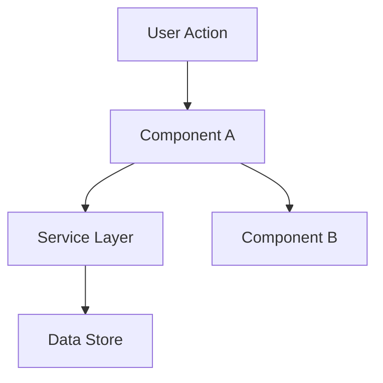

warning: |
  ⚠️ REGRAS ABSOLUTAS:
  - Design é OPCIONAL — só execute se houver decisão arquitetural significativa
  - NUNCA use quick mode ou auto-sizing
  - Verifique CONCERNS.md antes de projetar áreas frágeis
  - Apresente diagrama de componentes e aguarde APPROVAL antes de Tasks
  - Output: `features/[name]/design.md` (NÃO em fixes/)

# design — Design Arquitetural

**Quando usar esta fase:**
- Há decisões arquiteturais a tomar (novos padrões, integrações, serviços)
- Componentes novos precisam ser planejados antes da implementação
- Há dependências entre componentes que precisam ser explicitadas
- A feature requer data models complexos

**Quando PULAR esta fase:**
- Mudança direta — sem decisões arquiteturais, sem novos padrões
- Feature simples que pode ser implementada inline durante Execute
- Apenas ajustes em código existente sem mudanças estruturais

**Entrada:** `features/[name]/spec.md` e `features/[name]/context.md` (se existir)

**PI Packages — Diagramas (pi-mermaid):**
- Para diagramas, use `pi-mermaid` se instalado → renderiza em ASCII no TUI
- Se não instalado → blocos mermaid inline e recomende: `pi install npm:pi-mermaid`

---

## Processo

### 1. Carregar Contexto

```
features/[name]/
├── spec.md        # Obrigatório — requirements
└── context.md     # Opcional — decisões de implementação já feitas
```

Leia `features/[name]/spec.md` antes de desenhar. Se `features/[name]/context.md` existir, carregue também — contém decisões que restringem o design.

### 2. Salvar Estado: Design Started

```bash
echo "status: design_started
timestamp: $(date -u +%Y-%m-%dT%H:%M:%SZ)" > features/[name]/.state
```

### 3. Analisar Decisões Arquiteturais Necessárias

Identifique:
- Quais componentes novos são necessários?
- Quais integrações com sistemas existentes?
- Quais padrões de arquitetura aplicar?
- Quais data models precisam ser definidos?

Se não houver decisões significativas → **PULE esta fase**, vá direto para Tasks.

### 4. Pesquisar (Se Necessário)

Se a feature envolve tecnologia unfamiliar, pesquise antes de desenhar. Documente achados no design doc.

**CRITICAL: NUNCA assuma ou fabricate informação.** Se não conseguir encontrar resposta, diga "Eu não sei" ou "Não consegui encontrar documentação para isso".

### 5. Definir Arquitetura

#### Componentes Principais
Identifique cada componente: Purpose, Location, Interfaces, Dependencies, What it reuses.

#### Diagrama de Arquitetura
Use mermaid quando útil:



### 6. Code Reuse Analysis

**CRITICAL:** Qual código existente podemos aproveitar? Isso salva tokens e reduz erros.

Se `.specs/codebase/CONCERNS.md` existir, check antes de desenhar. Áreas marcadas como frágeis ou com dívida técnica requerem cuidado extra.

### 7. Definir Data Models

Se a feature envolve dados, defina modelos antes da implementação.

### 8. Salvar Estado: Design Complete

```bash
echo "status: design_complete
timestamp: $(date -u +%Y-%m-%dT%H:%M:%SZ)
design_approved: false" > features/[name]/.state
```

---

## Fluxo de Decisão

```
Discovery → Specify → [Design?] → Tasks → Execute
                ↓          ↓
                └──────────┴── Se há decisão arquitetural → DESIGN
                                      ↓
                         Se simples/direta → Tasks (pula Design)
```

---

## Template: `features/[name]/design.md`

```markdown
# [Feature] Design

**Spec**: `features/[name]/spec.md`
**Status**: Draft | Approved
**Created**: YYYY-MM-DD
**Updated**: YYYY-MM-DD

---

## Architecture Overview

[Brief description of the architecture approach]

### Components Diagram


---

## Code Reuse Analysis

### Existing Components to Leverage

| Component | Location | How to Use |
| --------- | -------- | ---------- |
| [Existing Component] | `src/path/to/file` | [Extend/Import/Reference] |
| [Existing Utility] | `src/utils/file` | [How it helps] |

### Integration Points

| System | Integration Method |
| ------ | ------------------ |
| [Existing API] | [How new feature connects] |
| [Database] | [How data connects] |

---

## Components

### [Component Name]

- **Purpose**: [What this component does - one sentence]
- **Location**: `src/path/to/component/`
- **Interfaces**:
  - `methodName(param: Type): ReturnType` - [description]
- **Dependencies**: [What it needs to function]
- **Reuses**: [Existing code this builds upon]

---

## Data Models (if applicable)

### [Model Name]

```typescript
interface ModelName {
  id: string
  field1: string
  field2: number
  createdAt: Date
}
```

**Relationships**: [How this relates to other models]

---

## Error Handling Strategy

| Error Scenario | Handling | User Impact |
| ------------- | -------- | ----------- |
| [Scenario 1] | [How handled] | [What user sees] |
| [Scenario 2] | [How handled] | [What user sees] |

---

## Tech Decisions (only non-obvious ones)

| Decision | Choice | Rationale |
| -------- | ------ | --------- |
| [What we decided] | [What we chose] | [Why - brief] |

---

## Approval

- [ ] Architecture approved by team
- [ ] Code reuse strategy validated
- [ ] Tech decisions documented
- [ ] Ready for Tasks phase

---

## Tips

- **Load context first** — If context.md exists, decisions there are locked
- **Research when uncertain** — 5 minutes of research prevents hours of rework
- **Reuse is king** — Every component should reference existing patterns
- **Interfaces first** — Define contracts before implementation
- **Small components** — If component does 3+ things, split it
- **Check CONCERNS.md** — If it exists, flag fragile areas the design must address
- **Confirm before Tasks** — User approves design before breaking into tasks
- **Autosave state** — Update .state file at end of each phase
```

---

## State Machine

```
┌─────────────────────────────────────────────────────────────┐
│                    lspec-design STATES                       │
├─────────────────────────────────────────────────────────────┤
│                                                              │
│  discovery_started ──► specify ──► design_started            │
│         │                              │                     │
│         │                              │ (if architectural   │
│         │                              │  decisions needed)  │
│         │                              ▼                     │
│         │                       design_complete               │
│         │                              │                     │
│         │                              ▼ (user approves)     │
│         │                       design_approved              │
│         │                              │                     │
│         └──────────────────────────────┴──► tasks_pending   │
│                                                              │
│  SKIP: No architectural decisions needed                      │
│    specify ──────────────────────────────► tasks_pending    │
│                                                              │
└─────────────────────────────────────────────────────────────┘
```

### State File: `features/[name]/.state`

```json
{
  "phase": "design",
  "status": "design_complete|design_approved|skipped",
  "started_at": "ISO8601",
  "completed_at": "ISO8601",
  "approved": false,
  "notes": "optional notes"
}
```

---

## Fluxo de Continuação

→ Design completo. Avançar para Tasks (obrigatório)?

**Se usuário não avançar:** salvar estado e aguardar.

```
features/[name]/.state → status: design_complete
Await → usuário confirma avançar
```