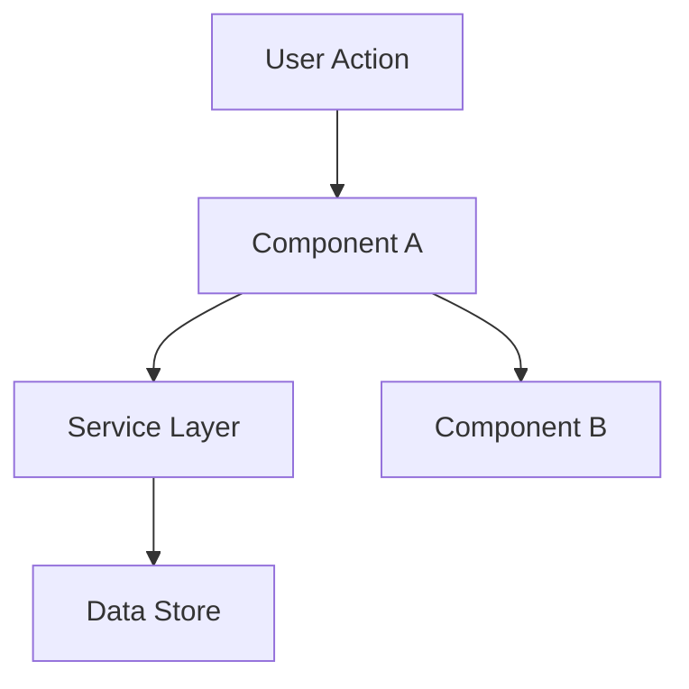

warning: |
  ⚠️ REGRA ABSOLUTA:
  - Nao invente arquitetura sem contexto do codebase
  - Verifique CONCERNS.md antes de projetar areas frageis
  - Apresente diagrama de componentes e aguarde APPROVAL antes de Tasks

# design — Design de Feature

**Goal:** Definir COMO construir. Arquitetura, componentes, o que reutilizar.

**Pule esta fase quando:** A mudanca e direta — sem decisoes arquiteturais, sem novos padroes, sem interacoes de componentes para planejar. Para features simples, design acontece inline durante Execute.

---

## Processo

### 1. Carregar Contexto

Leia `.specs/[feature]/spec.md` antes de desenhar. Se `.specs/[feature]/context.md` existir, carregue tambem — contem decisoes de implementacao que restringem o design.

### 2. Pesquisar (Opcional mas Recomendado)

Se a feature envolve tecnologia unfamiliar, padroes ou integracoes, pesquise antes de desenhar. Documente achados brevemente no design doc ou como notas inline.

**CRITICAL: NUNCA assuma ou fabrication informacao.** Se voce nao consegue encontrar uma resposta atraves da cadeia, diga explicitamente "Eu nao sei" ou "Nao consegui encontrar documentacao para isso".

### 3. Definir Arquitetura

Overview de como componentes interagem. Use diagramas mermaid quando util.

### 4. Identificar Reutilizacao de Codigo

**CRITICAL:** Qual codigo existente podemos aproveitar? Isso salva tokens e reduz erros.

Se `.specs/codebase/CONCERNS.md` existir, check antes de desenhar. Qualquer componente marcado como fragil, carregando divida tecnica, ou com gaps de cobertura de teste requer cuidado extra no design.

### 5. Definir Componentes e Interfaces

Cada componente: Purpose, Location, Interfaces, Dependencies, What it reuses.

### 6. Definir Data Models

Se a feature envolve dados, defina modelos antes da implementacao.

---

## Template: `.specs/[feature]/design.md`

```markdown
# [Feature] Design

**Spec**: `.specs/[feature]/spec.md`
**Status**: Draft | Approved

---

## Architecture Overview

[Brief description of the architecture approach]



---

## Code Reuse Analysis

### Existing Components to Leverage

| Component | Location | How to Use |
| --------- | -------- | ---------- |
| [Existing Component] | `src/path/to/file` | [Extend/Import/Reference] |
| [Existing Utility] | `src/utils/file` | [How it helps] |

### Integration Points

| System | Integration Method |
| ------ | ------------------ |
| [Existing API] | [How new feature connects] |
| [Database] | [How data connects] |

---

## Components

### [Component Name]

- **Purpose**: [What this component does - one sentence]
- **Location**: `src/path/to/component/`
- **Interfaces**:
  - `methodName(param: Type): ReturnType` - [description]
- **Dependencies**: [What it needs to function]
- **Reuses**: [Existing code this builds upon]

---

## Data Models (if applicable)

### [Model Name]

```typescript
interface ModelName {
  id: string
  field1: string
  field2: number
  createdAt: Date
}
```

**Relationships**: [How this relates to other models]

---

## Error Handling Strategy

| Error Scenario | Handling | User Impact |
| ------------- | -------- | ----------- |
| [Scenario 1] | [How handled] | [What user sees] |
| [Scenario 2] | [How handled] | [What user sees] |

---

## Tech Decisions (only non-obvious ones)

| Decision | Choice | Rationale |
| -------- | ------ | --------- |
| [What we decided] | [What we chose] | [Why - brief] |

---

## Tips

- **Load context first** — If context.md exists, decisions there are locked
- **Research when uncertain** — 5 minutes of research prevents hours of rework
- **Reuse is king** — Every component should reference existing patterns
- **Interfaces first** — Define contracts before implementation
- **Small components** — If component does 3+ things, split it
- **Check CONCERNS.md** — If it exists, flag fragile areas the design must address
- **Confirm before Tasks** — User approves design before breaking into tasks